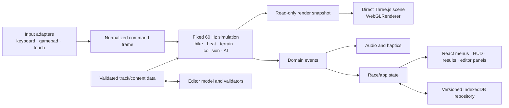

# RIVET RIDGE RALLY — Architecture

**Status:** Implemented RC architecture; final exact-candidate validation is tracked in `QA_REPORT.md`

**Milestone:** Phase 4 release hardening

**Release status:** **NOT READY**; the evidence-backed decision and open gates are tracked in `LAUNCH_READINESS.md`

**Latest-change validation:** Current dirty-working-tree typecheck, lint, `npm test`, asset verification, dependency audit, isolated production-mode compile, and scoped browser qualification pass as recorded in `QA_REPORT.md`; the retained normal `dist/`/notices checkpoint predates the latest source. Release qualification remains `UNVERIFIED` pending accepted visual baselines, an immutable tagged candidate, and exact-product performance, soak, smoke, rollback, manual approval, and attestation evidence

This document defines the implemented technical boundaries and the invariants contributors must preserve. Execution evidence belongs in `QA_REPORT.md`; architecture prose alone is never treated as a passing test.

## 1. Architectural goals

- Deterministic, testable arcade behavior at a fixed 60 Hz.
- Direct, inspectable Three.js/WebGL rendering without a game engine or React renderer abstraction.
- Low-frequency React UI isolated from high-frequency simulation and rendering.
- One authoritative rules path shared by player, AI, test play, and replays.
- Local-first, versioned persistence with recoverable migrations.
- Stable desktop and mobile performance with explicit budgets and quality tiers.
- Simple static deployment with no account, database, multiplayer, analytics, or backend dependency.

## 2. Technology contract

| Concern | Required choice |
|---|---|
| Language | TypeScript with strict type checking |
| Build/dev | Vite |
| 3D | Current stable Three.js pinned to an exact version when scaffolded |
| Production renderer | `WebGLRenderer` |
| UI | React for menus, HUD, settings, results, and editor panels only |
| App state | Zustand or a small explicit state machine |
| Simulation | Custom fixed-60 Hz arcade simulation |
| Collision assistance | Rapier only for justified static queries; never generic vehicle feel |
| Persistence | IndexedDB with explicit schema versions and migrations |
| Audio | Web Audio with original procedural cues |
| Unit tests | Vitest |
| Browser tests | Playwright |
| Accessibility | Axe plus manual keyboard/touch checks |

The manifest and lockfile pin Three.js `0.185.1` and the dependency graph. Release tooling is pinned separately to Node `26.4.0` in `.node-version` and npm `11.17.0` in `packageManager`. The ignored format-2 sidecar never certifies ambient `dist/`: it captures clean `HEAD`, creates a detached checkout at that commit, reads package/lock/Node inputs only there, and revalidates their bytes after install and build. The exact annotated tag object/type is captured and revalidated. The absolute npm launcher is resolved to a physical package root; the guard requires `name: npm`, the pinned version, canonical `bin/npm-cli.js`, and an entrypoint realpath match. It inventories the entire package in bytewise relative-path order using NUL-delimited directory, regular-file, and internal-symlink records, rejecting special, absolute-link, dangling-link, and escaping-link entries. These checks precede and bracket an isolated `npm ci --no-audit --no-fund` and sanitized non-QA `npm run build`; both npm user/global configs are the same empty temporary file and `ignore_scripts=false` is forced. Before install no ignored checkout entry is accepted; after install only `node_modules` is accepted; after build only `node_modules` and `dist` are accepted. Only regular files may replace root `dist/`; symlinks/special entries fail before copying, and recursive guarded failure cleanup removes root `dist/` plus file-or-directory sidecar output. The manifest records commit/tag/tag-object, platform/architecture, exact npm launcher hash/version plus package metadata/tree hash/counts/bytes, isolated-config/build commands, and package-lock/distribution hashes without local paths. Production smoke loads and validates that exact format-2 sidecar, then no-store fetches every manifest path from one dedicated root origin and recomputes per-file byte counts/SHA-256 plus the aggregate digest before opening the browser flow; its evidence embeds the manifest hash and source/toolchain/build identity. `ASSET_LICENSES.md` records dependency and asset review; source review alone is not executed evidence.

The release child environment prepends the directory of `process.execPath`, resolves `node` through that isolated path, and records its executable SHA-256. Version, file identity, and hash are checked before and after install/build. After the sidecar is written and again after temporary-worktree cleanup, source cleanliness, release-input bytes, annotated-tag identity, npm launcher identity, the full npm package tree, and resolved Node are revalidated before success is printed.

## 3. Runtime boundaries



React must not receive a per-object simulation tree or drive animation frame updates through component renders. The HUD may consume a small throttled/read-only view model; the renderer consumes snapshots directly.

## 4. Module shape

The repository uses these boundaries (some responsibilities are co-located where a separate module would add no value):

```text
src/
  app/             boot, route/state machine, React screens
  game/
    simulation/    fixed loop, bike, heat, terrain, landing, recovery
    race/          checkpoints, laps, timing, results, progression events
    ai/            shared-rule decisions and route planning
    input/         normalized keyboard/gamepad/touch adapters
    rendering/     Three scene, camera, effects, pooling, quality tiers
    audio/         Web Audio event consumers
  content/         versioned track/module definitions and validation
  editor/          commands, undo/redo, preview, library, import/export
  persistence/     IndexedDB schemas, migrations, repositories, recovery
  accessibility/   preferences and redundant feedback policies
  shared/          narrow types/utilities with proven multiple consumers
tests/
  unit/
  integration/
e2e/
```

Dependencies should flow inward toward pure rules/data. Rendering and React may observe simulation; simulation must not import React, Three.js scene objects, browser storage implementations, or audio playback.

## 5. Fixed-step simulation

The animation loop shall accumulate real elapsed time and execute zero or more fixed steps before rendering an interpolated snapshot:

```text
accumulator += clamp(frameDelta, 0, maxFrameDelta)
steps = 0
while accumulator >= 1/60 and steps < maxCatchUpSteps:
  environment = course.sample(player.snapshot)
  player.step(command, environment, 1/60)
  course.processPlayerEvents(player.snapshot)
  ai.stepAll(player.snapshot, 1/60)
  collisions.resolveAiPairsThenPlayerContact()
  accumulator -= 1/60
  steps += 1
renderer.render(simulation.snapshot(accumulator / (1/60)))
```

The implementation caps an active-race frame delta at 100 ms. Time discarded above that cap is accumulated in the hidden local HUD stream as `droppedSimulationMs`; the performance parser and soak artifact retain those readings rather than silently allowing an unbounded stall. Paused and finished frames do not count as dropped simulation time. Partial accumulated time runs no course, tutorial, AI, or contact rule. Every due fixed tick samples the player's current course environment, advances the player once, processes track/bike/tutorial events, advances every AI rider once, resolves AI pairs, and then resolves player/AI contact before the next catch-up tick. A catch-up callback therefore uses the same world-rule ordering as the same number of individual `1/60` callbacks.

Simulation time, lap timing, heat, AI decisions, landing checks, and recovery must use the fixed clock. Cosmetic particles and UI transitions may use render time but cannot affect results.

Outside cooling zones, the shared heat step gives Standard Ride a fixed 62% equilibrium: values below it rise toward 62 and values above it fall toward 62 without Standard Ride crossing that boundary. Turbo uses the same fixed clock but may continue beyond 62 into warning and overheat behavior; coasting and explicit cooling retain their separate rates.

The renderer may run while the pre-race gate is paused so a loaded course remains visible. Each engine owns a dedicated Three.js loading manager for the compressed hero bike-and-rider presentation. Rival/Mastery additionally owns a separate one-worker loader for the shared authored rival base; handcrafted Canyon Kickoff and Rider School own another independent compressed-asset loader for the authored modular GLB plus an isolated `ImageBitmapLoader` for the festival-canyon matte. `GameEngine.whenReady()` resolves after all applicable loads have either succeeded or reached their bounded fallbacks. Every asset path has a five-second readiness deadline, but the post-deadline policy is asset-specific. Hero, rival, and panorama timeouts immediately retain their complete safe procedural/generated presentation and release the race gate while their still-live request may settle later; a valid late result is validated detached and installed atomically, and a late hard failure leaves the fallback in place. The Canyon kit timeout is terminal and retains complete procedural scenery. Hero success resolves every required presentation root, wheel, pose pivot, and anchor before replacing the fallback. Rival success validates the exact 26-node base, prepares all five numbered/material variants with shared geometry, binds every bike/wheel/six-pivot reference, and only then hides the ten procedural presentation groups in one transaction. Disposal cancels pending work and disposes any result that settles afterward, so decoded resources cannot survive repeated restarts or mutate a disposed engine. React owns only the visible loading/countdown phase and keeps the engine paused through the tutorial intro or non-tutorial countdown. At the sole production engine-construction boundary, `GameView` normalizes tutorial sessions to the canonical Canyon track and masks any retained custom-track payload before deriving either the accessible course identity or the engine options. For a standard race it presents `GO`, yields enough animation frames for the browser to paint that label, and only then hands the engine to the racing phase. The race timer and gameplay input begin together on that fixed-step handoff rather than during asset loading, UI countdown, or an unseen post-`GO` delay.

## 6. Authoritative race model

The authoritative state shall include at minimum:

- lifecycle state, track/mode/difficulty, countdown and race clocks;
- player and AI lane/transition, longitudinal progress, speed, pitch, grounded state, heat, crash/recovery, and checkpoint state;
- ordered checkpoints, lap, finish order, penalties, collisions, crashes, and overheats;
- deterministic terrain/module contacts and generated domain events.

Player and AI riders shall call the same movement, surface, heat, collision, landing, and recovery systems. AI supplies commands and route decisions; it does not mutate privileged speed or collision state.

`BIKE_PERFORMANCE_LIMITS` exposes the standard/Turbo speed and acceleration caps used by the simulation so production target invariants cannot silently drift from physics. Handcrafted par and Solo times are statically bounded against a clean two-lap standard-Ride reference; Summit mastery uses `getMasteryTargetMs()` as the single source for both the store progression gate and `GameEngine` HUD/result target. The static contract is only a conservative floor. Exact tuning still requires resumed full-course deterministic player/AI reference runs without `qa-fast-race`.

After every fixed AI step, `GameEngine` enumerates each unique AI pair once by stable index order before running player-versus-rider contact. The pure pair resolver interprets signed progress independently of array ordering, requires both riders to be grounded in the same lane and inside one symmetric forgiveness distance, and crashes only the faster rear rider. Each later pair reads a fresh snapshot, so a rider forced into `crashed` phase cannot cascade into or repeat another pair outcome; finished riders are excluded. The bounded simulation that completes official classification after the player finishes uses the same per-step pair/recovery path with presentation cues suppressed. The existing player/AI wrapper delegates to the same pair rule while retaining the route-follower exemption for striking the player's rear.

## 7. Input architecture

Keyboard, Gamepad API, and pointer/touch adapters shall produce a common command frame containing normalized throttle, turbo, lane change, pitch, recovery, pause, and menu actions. Adapters shall handle focus loss, disconnect, pointer cancellation, and stuck-button cleanup.

Input prompt selection is presentation state. Remapping persists by stable logical action rather than raw display label. A Rider School engine starts with Touch prompts when its primary pointer is coarse, including wide tablets; fine-pointer contexts start with Keyboard prompts, and the first real keyboard, touch, or mapped gamepad command remains authoritative thereafter. Touch layout geometry and the original inline rally pictograms stay in UI code, while resulting commands enter the same buffer as keyboard/gamepad input. The pictograms are decorative; stable button names remain the accessibility contract, and Ride/Turbo retain visible text. `TouchButton` uses native button activation for keyboard and assistive-technology synthetic clicks, suppresses the compatibility click after a pointer hold, exposes `aria-pressed` for held/toggled controls, emits one-frame lane pulses, and clears stuck state on blur or forced reset. `PitchTouchControls` owns one shared `-1 | 0 | 1` direction so Up and Down are mutually exclusive; a release from the no-longer-active direction is ignored instead of writing zero over the active direction. Gamepad activity is derived only after mapping buttons, triggers, and axes through the same per-command thresholds used by the returned frame; neutral drift or a trigger below its action threshold cannot seize priority from an active keyboard or touch command. Gamepad Start records its command through `InputManager` before the React pause transition, and the next paused or running sample demotes a disconnected active gamepad to Keyboard so the HUD cannot retain stale prompts. Keyboard gameplay capture and the global pause shortcut reject events from interactive UI targets, and pause handling rejects repeated `keydown` events so native button activation remains available and a held key produces one lifecycle transition. `InputManager` latches the first non-repeat lane keydown until one eligible sample consumes it, so a complete keydown/keyup between fixed steps is delivered exactly once; settings changes, modifier cancellation, suspend/blur, and disconnect clear an unsampled tap. Remap capture assigns action-specific accessible names, rejects focus-navigation/browser/system key codes before persistence, and leaves Escape available for the default Pause action while capture is active. `InputManager` derives browser-default suppression from all eight effective bindings, including fallbacks, so any accepted remap is reliable during gameplay without intercepting keys used on interactive controls.

`App` treats `tutorial → settings → tutorial` as one keyed `tutorial-session`, paralleling the paused-race overlay without sharing race state. Both tutorial render states retain the same Fragment/Suspense/GameView child order, so React preserves the engine, canvas, lesson evidence, and local pause state while Settings is mounted above an inert/hidden game shell. Closing the overlay restores the intro Settings control before Lesson 1 or the first enabled training-pause action after a started lesson; Settings never invokes tutorial completion or skip persistence.

Tutorial evidence has two deliberately separate layers. Cumulative `demonstrated` and named-event flags support recap and diagnostics, while `TutorialLessonGate` accepts only the ordered signals required by the currently active lesson and resets its evidence scope on each lesson activation. Evidence from an earlier lesson therefore cannot pre-clear a later one. When the active requirement completes, the engine marks itself paused and pauses audio in the same fixed update before publishing the completion HUD; it does not suspend the input adapter, so held Ride or Turbo survives the 550 ms React presentation handoff and a release-based next lesson still requires an intentional release. After the final riding lesson, React keeps that engine paused throughout both contact drills and the final recap and forces held touch controls back to their released presentation state; keyboard/gamepad holds cannot advance the frozen route and are discarded when the tutorial engine is disposed. The critical-heat signal latches within its active lesson at the threshold crossing, allowing immediate Turbo release without requiring sustained red-zone heat or overheat. A focused lesson retry reconstructs the authoritative one-lap simulation and clears attempt-scoped engine, input, presentation, replay, and active-gate evidence while deliberately retaining the active lesson index and cumulative recap state; it is unavailable during the completion handoff and cannot award credit.

## 8. Three.js rendering

- One production `WebGLRenderer` owns the canvas and render loop.
- Scene objects visualize authoritative snapshots and never become gameplay truth.
- Repeated props, lane markers, vegetation, and editor modules should use instancing where beneficial.
- Bikes, effects, and transient hazards should use pooling where measurements justify it.
- glTF/GLB content should use Meshopt or Draco and KTX2/Basis textures as appropriate.
- LODs and lazy loading shall protect mobile budgets; essential first-race assets load before nonessential scenery.
- Camera logic consumes track look-ahead and landing targets from gameplay data.
- Low, Medium, High, and Auto quality profiles govern pixel ratio, shadows, post-effects, LOD distance, and scenery density without changing race rules.

`usesPortraitRacePresentation(width, height)` selects the portrait camera and composition whenever `height > width || width < 680`; narrow landscape canvases therefore use the same protected presentation rather than falling back to desktop framing solely because of orientation.

Handcrafted tracks create a two-batch, code-native start presentation: instanced cream digit segments stencil lanes `1`–`4`, and an instanced alternating-color line marks the start. Both batches are anchored through the course presentation route and remain render-only. `authoredCourse !== undefined` returns before either batch is constructed, records an explicit `authored-excluded` diagnostic, and leaves the editor's saved Start Grid geometry authoritative in Test Ride.

The Canyon/tutorial panorama is a regular sRGB 2D background texture, not an equirectangular/cubemap environment. This matches the frontal matte source, avoids six-face conversion memory and 360° distortion, and keeps it outside lighting and gameplay authority. The loader decodes 1024×512 on Low, 1536×768 on Medium, and the 1774×887 source on High, then applies a centered cover transform whenever the canvas resizes so desktop and portrait crops preserve aspect rather than stretch. The selected decode size is fixed when that engine is created; changing quality affects a subsequent race instead of reallocating a live background. The engine owns the texture, closes its `ImageBitmap` on disposal, and retains the procedural sky as a zero-network fallback.

Festival route pockets are emitted from deterministic placement records into the existing platform, canopy, post, body, and head `InstancedMesh` batches. Handcrafted Canyon presentation adds one mirrored pair 12 m beyond each of its first two unique cooling-gate definitions, with centers at least 12.35 m from the route center. The deterministic full-High layout preserves all 22 route pockets plus four cooling watchtowers—26 pockets and 104 tiers—while enforcing at least 5.6 m clearance. Authored marshal towers and the workshop are relocated outside those envelopes, and final structural-decor validation fails closed if any authored structure remains within 5.6 m of a festival pocket. The platform batch uses unit-box instances for its original deck plus two, three, or four outward-rising timber rows on Low, Medium, or High, and spectator transforms place each row's feet on the corresponding top surface. At cooling-gate placements only, the existing deck is raised to 2.72 m, its existing four post instances span 5.1 m, the existing canopy is raised to 5.55 m with mirrored teal/coral color, and two/three/four existing spectators move onto the deck by quality tier. This creates staffed elevated watchtowers without adding a material, geometry type, instance batch, or draw batch. `authoredCourse === undefined` is an explicit boundary because editor tracks inherit Canyon's visual identifier; non-Canyon and authored courses retain the legacy spacing, crowd count, and flat alternating pockets. The added venue records remain render-only and cannot affect collision, cooling, AI, timing, checkpoints, or replay state. Canvas diagnostics expose pocket style/count, tier count/rows, watchtower count/style, staffed-deck count, and authored-clearance state for browser qualification.

The shared festival start uses four, five, or six rows and 56, 90, or 132 spectators on Low, Medium, or High, plus one merged vertex-colored service-cluster batch. Track signatures remain bounded by quality: Pine reuses existing log/cabin batches for bump-aligned roots and red shoulder markers; Foundry adds one opaque emissive furnace-panel batch and per-instance cyan/orange gantry colors; Summit adds one merged bilateral finale-equipment batch outside the fence. Length-aware tuft/pebble counts are capped, and their placements plus the widened start structures are kept on explicit terrace tiers so increased source density is not hidden inside or floating across the terraced course edge. These batches are render-only and their runtime appearance, draw counts, and performance still require browser qualification.

Course-edge safety blocks use one existing `InstancedMesh`/material batch. Handcrafted Canyon and Rider School cover the full race-length corridor beginning at the pre-start wall edge with connected segments centered at ±7.70 m: Low/Medium/High use 8/6/4 m spans with 0.32/0.28/0.25 m overlap, respectively. The wall receives shadows on every tier and casts them only on High. The instance count is `2 × ceil(totalLength / span)`, while other handcrafted tracks retain bounded lap-zone runs. Authored courses return before constructing this generic batch because their inherited Canyon identifier must not place straight campaign blocks across saved curves or banks. Canvas diagnostics expose the selected style, batch count, and instance count for deferred browser qualification. These blocks are presentation-only and do not enter collision, terrain, AI, checkpoint, timing, or replay state.

The runtime creates dirt albedo and dirt height as separate deterministic CanvasTextures. Albedo is interpreted in sRGB; height remains non-color data and excludes the painted lane guides, preventing palette brightness from becoming false relief. Both layers share the same periodic rut paths and transform. The height texture is one cached procedural source with an engine-owned texture instance, so per-engine cleanup remains safe. Shallow instanced trapezoidal grass berms strengthen the campaign four-lane silhouette without adding collision or simulation state; their shadow pass is High-quality-only, and authored courses omit them so saved curve/bank meshes are not crossed by generic rails.

High-contrast campaign stripes use the shared route geometry and place internal guides above the maximum berm profile. Authored-course base stripes use the same saved centerline and remain visible only in exact uncovered intervals. Five fitted overlay strips are generated per unique piece geometry, colored through vertex attributes, and reused through `InstancedMesh` transforms for every matching piece/lap. Per-route-stripe visibility selects replacement intervals: 180-degree pieces reverse local channels, quarter turns use the local footprint and edge/lane-category coverage, and buried negative-height strips leave their fallback intact. This presentation path does not enter simulation or collision state.

Campaign and authored rendering use one `CoursePresentationRoute` boundary to map authoritative scalar progress plus local lateral/elevation offsets onto a renderer-only three-dimensional centerline. The same sampler places the road, shoulders and lane/edge guides, player and AI riders, camera and look target, shadows and dust, hazards and lap gates, safety treatment, and route-relative scenery. Campaign routes derive bounded pulses around protected corridors. Authored routes consume schema-v2 checkpoint anchors through version-1 quintic smootherstep interpolation. This shared mapping prevents a shaped road from separating visually from the objects that communicate its rules. Allocation-free X/Y/Z lookup tables retain first and second derivatives; the returned yaw/pitch/right/forward/up frame drives graded ribbons and rider presentation without becoming simulation input.

The presentation route is derived around protected flat, straight corridors covering hazard footprints, their readability margins, and lap transitions. C2-smooth lateral bends and positive rolling grade pulses occur only in available gaps and return to zero position/slope/curvature before every protected corridor. Z integration uses the lateral and vertical derivatives so authoritative scalar metres remain presentation arc length; every lap begins and ends flat. Summit receives the largest bounded rise/slope profile. Fixed-step progress, lane selection, surface sampling, collisions, AI decisions, checkpoints, lap credit, timing, and replay bytes remain scalar and authoritative; none reads a Three.js transform or presentation-route sample.

The broad ground underlay is another route ribbon rather than a flat world box, so graded shoulders cannot float above the venue floor. Short longitudinal berm, shelf, safety-wall, and fence-rail batches consume the route pitch while trees, crowds, posts, buildings, and other tall scenery remain world-upright at their sampled route elevation. Coastline keeps its outer ocean plane flat; only the inner bank follows the route before its generated normals blend to the water level. This is presentation geometry only.

The authored player GLB exposes `FrontTire` and `RearTire` as animated assembly roots so the ring, hub, brake disc, and authored tread blocks spin together. Its rear plate/`22`, layered side panels, and exhaust remain named and source-verified presentation parts. A separate lower-detail rival GLB exposes equivalent wheel roots and six pose pivots in one 26-node/12-primitive base. Rival/Mastery clones that base five times, retains the same 12 decoded `BufferGeometry` instances, clones its five materials per entrant, and replaces the embedded source number field with original 128×64 `17`, `31`, `46`, `58`, and `73` CanvasTextures. The detailed procedural player and five-rival field remain complete atomic fallbacks. Canvas diagnostics distinguish authored/fallback style, exact source metrics, clone count, number set, and shared geometry/instance counts for deferred inspection.

The runtime retains each procedural rider until its complete authored replacement transaction succeeds. Both authored and fallback riders expose six named pivots grouping torso, head, left/right arms, and left/right legs. `setRiderPose` reads only existing render-time speed, scalar progress, pitch, lane lean, height, phase, and accessibility values. It applies bounded tuck/cadence, airborne compensation, lean, or one static asymmetric crash pose before the authoritative whole-bike route transform. Reduced Motion resets all nonessential joint transforms and bob while preserving the static crash silhouette. These objects and transforms never feed simulation, collision, AI, input, timing, classification, or replay state. The fixed field size, one shared authored geometry base, and per-entrant material/number resources bound allocation growth; runtime draw cost and racing-distance readability remain performance/browser qualification gates rather than architectural claims.

Custom-track schema v2 stores optional checkpoint-only `{ lateralOffset, elevation }` anchors. Start and Finish are implicit zero anchors, so every lap seam is straight/flat and omitted anchors preserve the exact identity route. Adjacent anchors are bounded to ±16 m lateral, 0–12 m rise, 12° maximum rendered yaw after combined turn/grade, 9.5° maximum grade, and at least a 24 m lateral/vertical transition radius before rendering. Module rotations compose local-to-route after the sampled yaw/pitch frame; local module height remains separate. Builder preview and Test Ride consume the same authored centerline while fixed-step placement distance, collision footprint, gates, lap semantics, AI, timing, and replay remain scalar. The former independently moving `DistantCourseVista` is removed from the active renderer architecture; there is no second horizon route layered over the shared playable-course presentation.

WebGPU may be explored behind a disabled feature flag only after WebGL visual and gameplay parity is measured. It is not an RC1 dependency.

## 9. React and app state

An explicit app/race state machine shall prevent impossible flows and define retry behavior. React screens read state and dispatch semantic actions such as `START_SOLO`, `PAUSE`, `RETRY_RACE`, or `SAVE_TRACK`.

Race completion uses a two-phase handoff. The fixed-step engine synchronously emits its immutable result and one discriminated replay handoff when finish is committed. That handoff contains complete replay bytes or a typed `capacity`/`cadence`/`incomplete` failure reason; an unavailable replay is never passed to persistence and never blocks the result. The app store applies progression and records the result against the current `raceAttempt` immediately and idempotently, retaining any replay diagnostic separately from `RaceResult`; a separate guarded UI timer presents Results after the finish beat only if that same attempt is still the visible race session. Navigation or retry may cancel presentation, but cannot cancel or duplicate the committed result, and an old attempt cannot reopen Results over a newer state.

High-frequency values such as exact rider transforms remain outside React. HUD selectors shall be narrow and may update at a bounded visual rate. React unmount/remount must not reset an active simulation except through an explicit lifecycle transition.

`GameEngine.start()` emits the current authoritative simulation snapshot before it schedules the first animation frame. Loading and countdown UI therefore receives the selected target, field size, and lap contract without constructing placeholder race data.

Crash recovery presentation consumes the input-adaptive HUD hint and bounded recovery fraction. React renders the hint text plus a labeled `progressbar` with `aria-valuemin`, `aria-valuemax`, `aria-valuenow`, and a percentage `aria-valuetext`; it does not calculate or advance authoritative recovery. Simulation records the first typed crash cause for the active crash and clears it only when recovery begins. The engine translates `wheelie-timeout` into its own caption/audio/camera cue and suppresses duplicate telemetry only for a crash-landing event observed in the same fixed tick.

The narrow race stylesheet uses bounded geometry clamps for the position, timing, target, pause, steering, pitch, throttle, icons, heat, gaps, and safe-area padding across the 320–780 CSS-pixel touch range; critical telemetry type endpoints use rem units so UI scale remains effective. Its 140%-UI-scale contract keeps these surfaces inside the viewport without overlap in mirrored and standard layouts and preserves a 44×44 CSS-pixel minimum for every touch action, including Skip training. `touch-action: none` is scoped to the canvas and race controls; the tutorial card owns `pan-y` scrolling, bounded overscroll, a viewport-derived short-phone height, and its narrow-layout critical caption as a sticky in-card live region. Its 12-column progress row switches to zero reserved right margin, fixed pixel gaps, and shrink-safe tracks at narrow widths. Pause dialogs occupy a safe-area-aware, vertically scrollable stacking layer above the transient `GO` gate and below the full race-settings surface. Current emulated-project evidence includes a 6/6 touch-layout matrix and a 2/2 touch tutorial-intro run; this validates only those scripted viewport interactions, not physical-device geometry, ergonomics, assistive technology, or release-bound responsive acceptance.

## 10. Content pipeline

Track definitions and editor modules shall be data-first and versioned. Runtime validation shall reject incompatible or malformed content before it reaches simulation or rendering. Campaign tracks and editor examples use the same base schema, although handcrafted tracks may include signed/internal metadata unavailable to user JSON.

Assets shall be original, public-domain, or commercially licensed. `ASSET_LICENSES.md` records source, author, license, modification, attribution, shipped path, and verification status. The build-time asset contract fails if the Blender-authored hero bike-and-rider pipeline, Canyon kit, or shipped Canyon panorama differs from its recorded bytes/structure/provenance markers. The current working-tree contract binds the 49,780-triangle / 517,664-byte hero GLB (39,912 bike triangles, including 14,284 wheel triangles, plus 9,868 rider triangles), SHA-256 `538be4269927544fa91cfc405742523a60422d77d546ce9c8859f407deb2e6e8`, to its 15,165-byte manifest, SHA-256 `7622e9ceeabc7db2861049cb12c969e6e73e9149799b9ab4018cf11c18cb4b2a`, and source-pair UUID `31000dd4-2c42-4c74-ad5d-28b5e4aec32f`. The asset chain passes verification, focused hero action integration 5/5, the v20 headed action-state capture 15/15, and rival pack 2/2. The current non-QA `dist/` is a local diagnostic checkpoint, not a format-2 release artifact. Immutable-candidate verification, complete source/license review, and human legal/concept acceptance remain separate release gates.

## 11. Editor architecture

Editor changes use immutable serializable draft snapshots for apply/revert. A bounded history retains 50 actions, including checkpoint Route turn/rise edits. The Three.js canvas raycasts placed module descendants before sampled pick ribbons so reopening or clicking a module selects it rather than adding another. Pick meshes use a raycaster-only layer, adaptive coarse segmentation, and progress UVs that map directly to scalar progress and local lane; they do not enter camera render lists. Pointer-derived placement preview uses the same module dimensions, route frame, and collision bounds that validation and test play consume, with a text/symbol status in React in addition to scene color; the click path calls that same validator again and refuses an invalid candidate. The camera owns scalar route focus and local zoom separately from overview zoom. It samples the authored centerline while travelling or focusing a selection across the complete accepted 0–20,000 m range; outside the authored Start–Finish span it builds only a bounded, disposable local continuation surface and pick ribbon around the current focus. The React range control, explicit lane selector, and validator-backed Place action provide the equivalent keyboard-only creation path. **Fit route** unions exact foundation, scenery, course, and rebuilt module world bounds, then uses a limiting-FOV bounding-sphere fit that remains safe under arbitrary orbit and narrow aspect ratios. Route ribbons rebuild only when Start, Finish, checkpoint position, or checkpoint anchor data changes, and maximum-length ribbon detail is bounded adaptively. At phone widths the workspace becomes a scrollable three-row grid: the complete inspector follows the canvas, Export/Import stay in the wrapping toolbar, and the status notice remains exposed.

Validation is layered:

1. JSON shape, schema version, size, finite-number, and enum validation.
2. Module identity, bounds, snap/lane, and overlap validation.
3. Start/finish/checkpoint ordering, centerline derivative/curvature bounds, and lap-seam continuity.
4. Conservative drivable-route, overlap, and full rotated-footprint Start/Finish containment checks.
5. Declared difficulty and required metadata.

Test play converts a validated immutable snapshot into typed authored-course metadata. That metadata retains the ordered zero/checkpoint/zero centerline anchors plus every gate, track piece, obstacle footprint, route position, lane span, local rotation, height, and original `moduleId`. A pure contact resolver expands Jump Chain, Double Jump, Bump Row, and Offset Barriers into deterministic ordered sections while keeping the saved parent as the single policy/visual owner. Player and AI query the same frozen section list, use exact section spans and keys, and derive policy from the parent. Sideways rhythm modules retain one route footprint; offset barriers rotate their local blocker centers and lane spans through the saved cardinal transform. The renderer draws the parent once and uses the same proportions for its multi-part silhouette rather than rendering contact records as duplicate objects. The fixed-step race consumes ordered checkpoint distances and these shared obstacle policies while the renderer and Builder consume the same presentation centerline/transforms. Handcrafted tracks omit optional authored metadata and retain their tuned route fallback. Test Ride first attempts the bounded exact-base save, adopts a generated conflict-copy identity when needed, and launches that reconciled snapshot; a save rejection instead launches the already validated in-memory snapshot and retains both it and its exact persisted base for retry. If later retry creates a conflict copy, the store records that saved identity separately: the mounted engine keeps its immutable attempt snapshot, replay persistence binds to the saved identity, and only the next explicit Retry promotes it into the next attempt. Before this handoff, the store receives a structured-cloned, tab-scoped editor session containing the persisted base, thumbnail-bearing draft, both history stacks, active category/module, and valid selected placement. Save, Test Ride, import reading, and destructive library mutations hold an editor-wide in-flight guard so an asynchronous response cannot erase a newer draft; Open, import, and conflict-copy identity changes clear cross-document undo/redo history. Custom pause and results return directly to that session without race-mutation leakage; successful save/export or retry updates/clears only the matching pending snapshot.

Import shall parse plain data only. A single linear lexical preflight caps byte count, item count, string length, and nesting before `JSON.parse`; strict Zod interchange objects then reject unknown fields before the shared coordinate, module, overlap, and route validators run. It must never evaluate scripts, accept arbitrary URLs, or trust thumbnails embedded as executable markup.

## 12. Persistence and migrations

IndexedDB access shall sit behind typed repositories. A root schema/version record identifies profiles, settings, progression, results, custom tracks, and optional replay formats.

Dexie auto-open is disabled. Every repository operation passes through one shared explicit open promise; a blocked version-open gets a short grace period for the other tab to close, then rejects as `blocked` so Boot can enter disclosed session mode and Retry can reopen later. Complete strict settings/progress record schemas validate identity, version, timestamp, and value. Recovery re-reads both profile records in one transaction, rejects future schemas, preserves invalid data, and writes only a missing/invalid side. Normal tab-local settings/progress writes are separately serialized; each transaction rereads the latest stored row, applies only the caller's base→next setting leaves, merges disjoint key-remap actions with a local-wins collision repair, and merges progress gains monotonically with best-time lap/split arrays kept as one winning unit. The queue adopts each actual merged database result and rebases any later local mutation. Retry holds a profile-write barrier, preserves explicit reset revisions, rebases settings/progress mutations made while reopening storage, drains the resulting queues, and may return to persistent mode only if no newer failure reblocked writes. Custom-track recovery rechecks the current same-ID snapshot; ordinary editor saves compare the exact persisted base, create a new named/UUID conflict copy on divergence, and stale deletes refuse after a user confirmation. Replay insertion, deterministic 20-record exact-course pruning, and the 100-record global cap share one transaction. Built-in `courseKey` values are track IDs; custom keys bind the custom-track ID to an immutable authored-course revision so an edited or unavailable course fails closed instead of receiving the wrong replay. The editor lists retained recovery records and exports an inert, portable JSON package whose tagged structured-clone representation preserves cycles and non-JSON value types alongside the recovery reason. Its encoder tracks depth, nodes, strings, and exact compact-JSON output while walking; Blob/File and buffer sizes reserve Base64 output before bytes are read, and unmeasurable aggregate records reject new writes. One exported 500-module ceiling is consumed by editor placement/duplication, full validation, persistence, import, and Test Ride.

Each campaign track's version-1 progress record may carry bounded optional standing-Solo lap and checkpoint arrays alongside `bestSoloMs`. Their optional shape keeps existing saves backward compatible. The progression reducer structured-clones state, replaces all three values only on a strictly faster Solo finish, and copies the previous arrays into the attempt-scoped result for signed Results comparisons without mutating the stored personal best on an equal or slower run.

Custom-track schema v2 adds only the optional checkpoint route anchor. Dexie database version 6 (native IndexedDB version 60) retains the version-5 custom-track migration and adds the sparse replay `courseKey` index; legacy replay records remain untouched and may lack that key. Structurally valid v1 custom-track roots that meet current semantics upgrade by changing only `schemaVersion`; all modules, identifiers, timestamps, and thumbnail bytes remain untouched. A v1 track accepted under the former center-only route boundary but needing current full-parent-footprint repair remains stored as v1 and is normalized to editable v2 data in memory without quarantine; current save/Test Ride/export remains blocked until repair. V1 JSON imports use the same compatibility path, while successful save/export always emit v2. Future versions fail closed and remain in place. The native-version barrier prevents an older v5 build from opening and mutating records written by the replay-indexed application.

Migration rules:

- migrations are ordered, one-way, idempotent where practical, and unit tested;
- an upgrade uses transactional stores and does not partially commit;
- incompatible/corrupt records are quarantined or reset at the narrowest safe scope;
- the user receives a clear recovery/export/reset path;
- defaults are versioned and do not overwrite valid user choices;
- quota and unavailable-storage failures degrade to a clearly disclosed session mode.

No cloud backup is implied. Safe track export is the user-controlled backup path for custom creations.

## 13. Audio and feedback

Simulation emits semantic events such as turbo warning, overheat, clean landing, hard landing, crash cause, cooling entry, checkpoint, finish, and UI action. Audio, captions, camera shake, effects, and haptics subscribe independently so reduced motion, volume, captions, and unsupported vibration do not alter gameplay.

Web Audio unlock/resume behavior shall account for browser autoplay restrictions and pause/background transitions.

## 14. Reliability and lifecycle

- Boot separates shell availability from essential and nonessential asset loading.
- Required asset failures show retry and diagnostic context; optional asset failures use a documented fallback.
- Unsupported WebGL/browser conditions show a non-crashing explanation.
- Offline behavior reflects what is actually cached; no false “offline ready” claim is permitted. The page imports both lazy race/editor entry points, then accepts readiness only from an acknowledgement whose cache identity matches the expected generation and whose sender is still the page's current service-worker controller. Every later `controllerchange` synchronously clears the page's readiness datasets, notifies subscribed UI, and requests one guarded preparation pass; a change received during active preparation records one pending rerun. A later `online` event also retries while the exact current generation is not ready. Readiness stays conservative until the replacement controller completes a fresh exact-generation acknowledgement.
- The current service worker is `rivet-ridge-rally-shell-v35`. Install fetches `index.html` once with `cache: "reload"`, clones that response under `/` and `/index.html`, and fetches every core asset—including the SVG/PNG install-icon set, both bundled display-font subsets, `/assets/3d/hero-bike-rider.glb`, `/assets/rivals/rival-pack.glb`, and the Canyon modular GLB—plus each hashed asset discovered from the HTML before writing the batch. If a fetch/cache write fails, a final response leaves the static allowlist, or a response forbids storage with `no-store`/`Vary: *`, the worker deletes the partial v35 cache and rejects installation. Ordinary CDN variance is ignored only for requests already inside the query-free static allowlist. Runtime warming is bounded to 128 credential-free/query-free root, index, manifest, or `/assets/` URLs per message; serialized runtime writes cap the complete current cache at 192 entries across repeated warming and generic misses, validate the final response boundary, and may accept an already cached matching URL when refresh fails. Generic runtime caching ignores every other same-origin path. Rejected, cross-origin-final, and 5xx navigations fall back to the last complete current-or-transition shell while genuine same-origin 4xx responses remain visible.
- Cache lookup prefers v35 and may fall back only to the immediately previous app-owned transition cache. Activation removes older app generations while leaving unrelated origin caches untouched. This transition window prevents an old open tab from losing its hashed lazy assets without allowing stable URLs from the previous generation to override current bytes.
- Visibility changes pause or safely suspend input/audio/simulation according to mode.
- Restart disposes or reuses Three.js resources without duplicated listeners, render loops, audio nodes, or IndexedDB handles.
- A failed initial profile read leaves persistence writes disabled. Retry reopens IndexedDB and validates existing records before any write; valid stored values take precedence, while missing or invalid records receive the current session fallback. After a later write failure, retry transactionally reapplies only changes since the last confirmed local base and honors any pending explicit progress reset before background queues resume.
- The live `GameEngine` is keyed by explicit race identity and attempt, not by mutable campaign-progress object identity. A persistence retry may reconcile the profile store, but it cannot dispose or reconstruct the current paused engine; the next explicit attempt snapshots the reconciled best time and mastery level.

## 15. Performance budgets and observability

The runtime exposes a hidden local diagnostic stream for FPS, render work, draw calls, accumulated dropped fixed-step time, and load/restart measurements. Canvas diagnostics also report the presence and current visibility of real renderer accessibility geometry so browser tests can distinguish WebGL behavior from CSS-only settings. These signals are consumed by local QA tooling, are not visibly enabled for players, and never transmit data. Pool sizes and asset/bundle measurements are captured by the repository harnesses.

Optimization decisions should follow captures. Required techniques—compression, pooling, instancing, LOD, and lazy loading—shall be applied where relevant and verified for visual parity. Initial gameplay transfer targets under 12 MB compressed where practical.

## 16. Security and privacy

- No secrets or privileged APIs belong in the browser bundle.
- Imported editor data is hostile input and receives bounded validation.
- User-provided names are rendered as text, never raw HTML.
- External links, if any, use safe navigation attributes and a documented allowlist.
- Dependencies are pinned, locked, audited, and reviewed before release.
- The default runtime sends no gameplay, identity, or analytics data to third parties.

## 17. Test architecture

### Unit and integration

Vitest shall cover fixed-step timing, heat transitions, lane changes, terrain modifiers, pitch/landing envelopes, crash recovery, checkpoint/lap rules, collision asymmetry, AI rule parity, progression, settings, editor commands/history, validation, imports, and IndexedDB migrations.

### Browser flows

Playwright shall exercise fresh-load tutorial/race/results/save/retry, campaign unlocks, pause/resume, keyboard navigation, settings, touch layouts, and an editor create/save/reload/test-play/import rejection journey. Console and failed-request assertions are release gates. Current working-tree scoped runs cover the focused Chromium functional, reliability, tutorial, editor, input, migration, persistence, and quality paths; campaign modes 18/18 in 20.0 minutes; rival pack 2/2; 10/10 Firefox-plus-WebKit desktop functional cases; 6/6 WebKit lifecycle cases; 6/6 emulated touch-matrix cases; and 2/2 emulated touch tutorial-intro cases. None of these dirty-tree scoped runs replaces the required frozen-candidate matrix.

Current working-tree command evidence also records passing typecheck and lint; `npm test` with 450 checks (300 Vitest, 45 release-manifest fixtures, 71 release-attestation fixtures, and 34 production-smoke/service-worker/release-scope fixtures); asset verification for the 49,780-triangle / 517,664-byte hero and its manifest/source-pair binding, rival contract, 32,008-triangle / 427,028-byte Canyon kit, and production art/provenance; `npm audit --audit-level=high` with zero vulnerabilities; and the current production-mode Vite compile of 145 modules with no Vite chunk-size warning after the Three manual-chunk split. The latest normal build/notices regenerated repository `dist/`; these results are still not clean-tag or format-2 artifact evidence.

The current non-QA local `dist/` on `127.0.0.1:4173` is a diagnostic checkpoint of 33 files and 7,999,709 raw bytes. `index.html` is 1,632 bytes with SHA-256 `737fb0b42dc502e139225cc3af1c69c306b8a472544176867d214257b13beb15`; the inventory aggregate is `98130df16f3dfdfd58aa1c3bf843da2849c49d31ae01e9ac3acdf5217ae56fc1`; and the 43,872-byte notices have SHA-256 `f837ed705667d0f3976bbd419f42d8c63844a3eb4b52f76db88ed3a1d6e270c2`. A scoped live production-preview smoke found no QA API or runtime/request/HTTP errors and the authored hero ready, with the preview process retained for resumed testing. This dirty-tree evidence is not a format-2 manifest, installed/offline smoke, immutable artifact, or release qualification.

The current headed diagnostic at `artifacts/candidate-evidence/diagnostic/performance/current-0049739-headed-rebuilt-20260719T060319Z.json` records clean source/runtime binding to `0049739`, stable served bytes, authored hero readiness, and no request, HTTP, console, or page errors. Desktop normal/stress measures 60.00/60.01 FPS with 2.8/3.1 ms p95 synchronous frame work, and emulated-mobile normal/stress measures 60.00/60.00 FPS with 3.7/4.4 ms p95. Its overall result is `FAIL` only because no format-2 release manifest exists yet; it does not satisfy the schema-4 release-performance architecture gate or provide physical-device proof.

The corrected Canyon composition passes its three targeted unit checks and both scoped quality-preset/authored-Canyon runtime cases. A normal nonqualifying local preview additionally reported no QA API, ready bike/Canyon/environment state, 42 Canyon-kit placements, 26 pockets, 104 tiers, advancing race time, and working pause/resume. That inspection is local runtime evidence only, not a manifest-bound production smoke, offline result, performance measurement, or release artifact.

The earlier v2 hero-motion visual contract at `artifacts/visual-review/hero-remodel-2026-07-17-qa-pass-v2/manifest.json` is retained as a 10,268-byte, six-capture historical record with SHA-256 `527327c298edcb2404bf7853611db3e7785336b4888723fabcea67f017a015de`. The current technical contract is the 121,832-byte v20 manifest at `artifacts/visual-review/hero-motion-action-states-v20-current-20260718t-mechanical-detail-qamode/manifest.json`, SHA-256 `9a6beeb30396e57054d5f5aa4500ec32cd2d9f9ca8746eb48846f2f7cca24223`, which records `PASS` for all 15 required states in headed Chromium with browser audio muted, public-UI navigation, authored hero/Canyon/environment readiness, and the deliberate hero fallback. It explicitly records `conceptFidelityClaimed: false`, `visualAcceptance: PENDING_OWNER_REVIEW`, and `baselinePromoted: false`; therefore it is not owner acceptance, a promoted baseline, or legal/concept approval, and the visuals remain **NOT ACCEPTED**.

Earlier exact-tip evidence remains retained and unresolved. Its harness now freezes the production-length Canyon route rather than combining `qa-fast-race`'s 84 m gameplay distances with production decor. That invalid hybrid legitimately placed one structure only 1.8799 m from a festival pocket and tripped the 5.6 m guard; it was a harness prerequisite defect, not evidence of production asset failure. The corrected harness asserts 26 pockets, 104 tiers, and 1,320 course-edge safety blocks, allows 90 seconds per test and 20 seconds for screenshots, and passes every production-asset readiness prerequisite. The exact-tip full suite still ends 5 failed / 5 skipped against a 2% threshold: desktop differs by 633,032 pixels (about 69%), curved Canyon lacks a baseline, editor differs by 196,238 (about 22%), high contrast by 315,169 (about 35%), and portrait by 131,538 (about 39%). Separate title checks also fail at 49,370 pixels (about 6%) in Chromium, 51,119 (about 6%) in Firefox, and 53,317 (about 6%) in WebKit. No baseline was created, changed, or promoted.

The installed-Chrome production smoke is a second boundary, not a generic dev-server journey. It rejects a missing or malformed format-2 manifest and any non-root, credential-bearing, or non-HTTP(S) base URL; validates product/version, annotated source tag, pinned toolchain/build provenance including the Node executable hash and complete npm-package-tree attestation, file inventory, totals, and aggregate; binds the runtime commit; fetches every served file with no-store/no-cache semantics from the dedicated origin; compares the served bytes to every manifest record both before and after the browser journey; fetches `/` separately and requires it to equal manifest `index.html` without cross-origin redirect; and rejects browser navigation that leaves the origin before exercising boot/version, race/restart, editor, current-controller shell-v35 readiness, cached Practice while offline, and offline reload. Each run writes only the screenshots it actually captured into a unique staged bundle and atomically promotes that bundle under the full manifest SHA-256; invalid manifests use a separate unbound failure namespace, and retained historical evidence is never overwritten. The JSON evidence carries the normalized credential-free root, entrypoint, manifest, and served-release identity. This path is implemented but remains `UNVERIFIED` until one clean tagged exact candidate has a format-2 manifest and qualifying production/offline run.

### Accessibility and visuals

Axe runs on applicable UI screens. Screenshot coverage spans core screens, high contrast, UI scaling, 16:9, ultrawide, tablet, phone, and narrow fallback. Manual tests cover gameplay-critical captions, color redundancy, touch reach, gamepad, motion comfort, and camera readability.

## 18. Deployment shape

The output is a static, versioned web artifact containing hashed immutable assets and a short-cache application shell. Deployment, cache invalidation, monitoring, support, backup, and rollback procedures are defined in `docs/OPERATIONS.md`. Selecting and authenticating to the public host remains an owner action.

## 19. Architecture acceptance gate

This architecture is accepted for a release candidate only after the repository demonstrates:

1. a pinned, reproducible production build with strict type checking;
2. a real-browser fixed-step race loop independent of React rendering;
3. shared player/AI rules and renderer/simulation separation in code and tests;
4. recoverable versioned persistence and safe editor import validation;
5. measured performance and clean resource lifecycle across restart/test play;
6. passing unit, browser, accessibility, and release checks recorded in `QA_REPORT.md`.

Current evidence and remaining exceptions are recorded requirement-by-requirement in `QA_REPORT.md`. Current working-tree static/unit/build/audit and scoped browser paths pass, while visual acceptance, shell-v35 exact-product smoke, performance, soak, rollback, attestation, physical/manual review, and immutable source identity remain `UNVERIFIED`; acceptance must not be inferred from this document.
