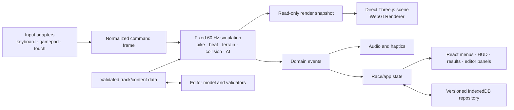

# RIVET RIDGE RALLY — Architecture

**Status:** Implemented RC architecture; final exact-candidate validation is tracked in `QA_REPORT.md`

**Milestone:** Phase 4 release hardening

**Release status:** Pending the final evidence-backed decision in `LAUNCH_READINESS.md`

This document defines the implemented technical boundaries and the invariants contributors must preserve. Execution evidence belongs in `QA_REPORT.md`; architecture prose alone is never treated as a passing test.

## 1. Architectural goals

- Deterministic, testable arcade behavior at a fixed 60 Hz.
- Direct, inspectable Three.js/WebGL rendering without a game engine or React renderer abstraction.
- Low-frequency React UI isolated from high-frequency simulation and rendering.
- One authoritative rules path shared by player, AI, test play, and replays.
- Local-first, versioned persistence with recoverable migrations.
- Stable desktop and mobile performance with explicit budgets and quality tiers.
- Simple static deployment with no account, database, multiplayer, analytics, or backend dependency.

## 2. Technology contract

| Concern | Required choice |
|---|---|
| Language | TypeScript with strict type checking |
| Build/dev | Vite |
| 3D | Current stable Three.js pinned to an exact version when scaffolded |
| Production renderer | `WebGLRenderer` |
| UI | React for menus, HUD, settings, results, and editor panels only |
| App state | Zustand or a small explicit state machine |
| Simulation | Custom fixed-60 Hz arcade simulation |
| Collision assistance | Rapier only for justified static queries; never generic vehicle feel |
| Persistence | IndexedDB with explicit schema versions and migrations |
| Audio | Web Audio with original procedural cues |
| Unit tests | Vitest |
| Browser tests | Playwright |
| Accessibility | Axe plus manual keyboard/touch checks |

The manifest and lockfile pin Three.js `0.185.1` and the complete toolchain. `ASSET_LICENSES.md` records dependency and asset review; package presence alone is not feature evidence.

## 3. Runtime boundaries



React must not receive a per-object simulation tree or drive animation frame updates through component renders. The HUD may consume a small throttled/read-only view model; the renderer consumes snapshots directly.

## 4. Module shape

The repository uses these boundaries (some responsibilities are co-located where a separate module would add no value):

```text
src/
  app/             boot, route/state machine, React screens
  game/
    simulation/    fixed loop, bike, heat, terrain, landing, recovery
    race/          checkpoints, laps, timing, results, progression events
    ai/            shared-rule decisions and route planning
    input/         normalized keyboard/gamepad/touch adapters
    rendering/     Three scene, camera, effects, pooling, quality tiers
    audio/         Web Audio event consumers
  content/         versioned track/module definitions and validation
  editor/          commands, undo/redo, preview, library, import/export
  persistence/     IndexedDB schemas, migrations, repositories, recovery
  accessibility/   preferences and redundant feedback policies
  shared/          narrow types/utilities with proven multiple consumers
tests/
  unit/
  integration/
e2e/
```

Dependencies should flow inward toward pure rules/data. Rendering and React may observe simulation; simulation must not import React, Three.js scene objects, browser storage implementations, or audio playback.

## 5. Fixed-step simulation

The animation loop shall accumulate real elapsed time and execute zero or more fixed steps before rendering an interpolated snapshot:

```text
accumulator += clamp(frameDelta, 0, maxFrameDelta)
steps = 0
while accumulator >= 1/60 and steps < maxCatchUpSteps:
  command = input.sampleForStep()
  simulation.step(command, 1/60)
  accumulator -= 1/60
  steps += 1
renderer.render(simulation.snapshot(accumulator / (1/60)))
```

The implementation caps an active-race frame delta at 100 ms. Time discarded above that cap is accumulated in the hidden local HUD stream as `droppedSimulationMs`; the performance parser and soak artifact retain those readings rather than silently allowing an unbounded stall. Paused and finished frames do not count as dropped simulation time.

Simulation time, lap timing, heat, AI decisions, landing checks, and recovery must use the fixed clock. Cosmetic particles and UI transitions may use render time but cannot affect results.

## 6. Authoritative race model

The authoritative state shall include at minimum:

- lifecycle state, track/mode/difficulty, countdown and race clocks;
- player and AI lane/transition, longitudinal progress, speed, pitch, grounded state, heat, crash/recovery, and checkpoint state;
- ordered checkpoints, lap, finish order, penalties, collisions, crashes, and overheats;
- deterministic terrain/module contacts and generated domain events.

Player and AI riders shall call the same movement, surface, heat, collision, landing, and recovery systems. AI supplies commands and route decisions; it does not mutate privileged speed or collision state.

## 7. Input architecture

Keyboard, Gamepad API, and pointer/touch adapters shall produce a common command frame containing normalized throttle, turbo, lane change, pitch, recovery, pause, and menu actions. Adapters shall handle focus loss, disconnect, pointer cancellation, and stuck-button cleanup.

Input prompt selection is presentation state. Remapping persists by stable logical action rather than raw display label. Touch layout geometry stays in UI code, while resulting commands enter the same buffer as keyboard/gamepad input.

## 8. Three.js rendering

- One production `WebGLRenderer` owns the canvas and render loop.
- Scene objects visualize authoritative snapshots and never become gameplay truth.
- Repeated props, lane markers, vegetation, and editor modules should use instancing where beneficial.
- Bikes, effects, and transient hazards should use pooling where measurements justify it.
- glTF/GLB content should use Meshopt or Draco and KTX2/Basis textures as appropriate.
- LODs and lazy loading shall protect mobile budgets; essential first-race assets load before nonessential scenery.
- Camera logic consumes track look-ahead and landing targets from gameplay data.
- Low, Medium, High, and Auto quality profiles govern pixel ratio, shadows, post-effects, LOD distance, and scenery density without changing race rules.

WebGPU may be explored behind a disabled feature flag only after WebGL visual and gameplay parity is measured. It is not an RC1 dependency.

## 9. React and app state

An explicit app/race state machine shall prevent impossible flows and define retry behavior. React screens read state and dispatch semantic actions such as `START_SOLO`, `PAUSE`, `RETRY_RACE`, or `SAVE_TRACK`.

High-frequency values such as exact rider transforms remain outside React. HUD selectors shall be narrow and may update at a bounded visual rate. React unmount/remount must not reset an active simulation except through an explicit lifecycle transition.

## 10. Content pipeline

Track definitions and editor modules shall be data-first and versioned. Runtime validation shall reject incompatible or malformed content before it reaches simulation or rendering. Campaign tracks and editor examples use the same base schema, although handcrafted tracks may include signed/internal metadata unavailable to user JSON.

Assets shall be original, public-domain, or commercially licensed. `ASSET_LICENSES.md` records source, author, license, modification, attribution, shipped path, and verification status. Build-time validation should fail on unregistered shipped assets once the pipeline exists.

## 11. Editor architecture

Editor changes use immutable serializable draft snapshots for apply/revert. A bounded history retains 50 actions. Placement preview uses the same module dimensions and collision bounds that validation and test play consume.

Validation is layered:

1. JSON shape, schema version, size, finite-number, and enum validation.
2. Module identity, bounds, snap/lane, and overlap validation.
3. Start/finish/checkpoint ordering and graph continuity.
4. Conservative drivable-route and collision-bound checks.
5. Declared difficulty and required metadata.

Test play converts a validated immutable snapshot into typed authored-course metadata. That metadata retains every gate, track piece, obstacle footprint, route position, lane span, rotation, and height; the fixed-step race consumes its ordered checkpoint distances and obstacle policies while the renderer consumes the same transforms. Handcrafted tracks omit this optional metadata and retain their tuned route fallback. Returning to the editor restores the draft and history without leaking race mutations.

Import shall parse plain data only. It must cap byte count, item count, string length, coordinates, and nesting before allocation-heavy processing. It must never evaluate scripts, accept arbitrary URLs, or trust thumbnails embedded as executable markup.

## 12. Persistence and migrations

IndexedDB access shall sit behind typed repositories. A root schema/version record identifies profiles, settings, progression, results, custom tracks, and optional replay formats.

Migration rules:

- migrations are ordered, one-way, idempotent where practical, and unit tested;
- an upgrade uses transactional stores and does not partially commit;
- incompatible/corrupt records are quarantined or reset at the narrowest safe scope;
- the user receives a clear recovery/export/reset path;
- defaults are versioned and do not overwrite valid user choices;
- quota and unavailable-storage failures degrade to a clearly disclosed session mode.

No cloud backup is implied. Safe track export is the user-controlled backup path for custom creations.

## 13. Audio and feedback

Simulation emits semantic events such as turbo warning, overheat, clean landing, hard landing, crash cause, cooling entry, checkpoint, finish, and UI action. Audio, captions, camera shake, effects, and haptics subscribe independently so reduced motion, volume, captions, and unsupported vibration do not alter gameplay.

Web Audio unlock/resume behavior shall account for browser autoplay restrictions and pause/background transitions.

## 14. Reliability and lifecycle

- Boot separates shell availability from essential and nonessential asset loading.
- Required asset failures show retry and diagnostic context; optional asset failures use a documented fallback.
- Unsupported WebGL/browser conditions show a non-crashing explanation.
- Offline behavior reflects what is actually cached; no false “offline ready” claim is permitted.
- Visibility changes pause or safely suspend input/audio/simulation according to mode.
- Restart disposes or reuses Three.js resources without duplicated listeners, render loops, audio nodes, or IndexedDB handles.

## 15. Performance budgets and observability

The runtime exposes a hidden local diagnostic stream for FPS, render work, draw calls, accumulated dropped fixed-step time, and load/restart measurements. Canvas diagnostics also report the presence and current visibility of real renderer accessibility geometry so browser tests can distinguish WebGL behavior from CSS-only settings. These signals are consumed by local QA tooling, are not visibly enabled for players, and never transmit data. Pool sizes and asset/bundle measurements are captured by the repository harnesses.

Optimization decisions should follow captures. Required techniques—compression, pooling, instancing, LOD, and lazy loading—shall be applied where relevant and verified for visual parity. Initial gameplay transfer targets under 12 MB compressed where practical.

## 16. Security and privacy

- No secrets or privileged APIs belong in the browser bundle.
- Imported editor data is hostile input and receives bounded validation.
- User-provided names are rendered as text, never raw HTML.
- External links, if any, use safe navigation attributes and a documented allowlist.
- Dependencies are pinned, locked, audited, and reviewed before release.
- The default runtime sends no gameplay, identity, or analytics data to third parties.

## 17. Test architecture

### Unit and integration

Vitest shall cover fixed-step timing, heat transitions, lane changes, terrain modifiers, pitch/landing envelopes, crash recovery, checkpoint/lap rules, collision asymmetry, AI rule parity, progression, settings, editor commands/history, validation, imports, and IndexedDB migrations.

### Browser flows

Playwright shall exercise fresh-load tutorial/race/results/save/retry, campaign unlocks, pause/resume, keyboard navigation, settings, touch layouts, and an editor create/save/reload/test-play/import rejection journey. Console and failed-request assertions are release gates.

### Accessibility and visuals

Axe runs on applicable UI screens. Screenshot coverage spans core screens, high contrast, UI scaling, 16:9, ultrawide, tablet, phone, and narrow fallback. Manual tests cover gameplay-critical captions, color redundancy, touch reach, gamepad, motion comfort, and camera readability.

## 18. Deployment shape

The output is a static, versioned web artifact containing hashed immutable assets and a short-cache application shell. Deployment, cache invalidation, monitoring, support, backup, and rollback procedures are defined in `docs/OPERATIONS.md`. Selecting and authenticating to the public host remains an owner action.

## 19. Architecture acceptance gate

This architecture is accepted for a release candidate only after the repository demonstrates:

1. a pinned, reproducible production build with strict type checking;
2. a real-browser fixed-step race loop independent of React rendering;
3. shared player/AI rules and renderer/simulation separation in code and tests;
4. recoverable versioned persistence and safe editor import validation;
5. measured performance and clean resource lifecycle across restart/test play;
6. passing unit, browser, accessibility, and release checks recorded in `QA_REPORT.md`.

Current evidence and any remaining exceptions are recorded requirement-by-requirement in `QA_REPORT.md`; do not infer acceptance from this document.
